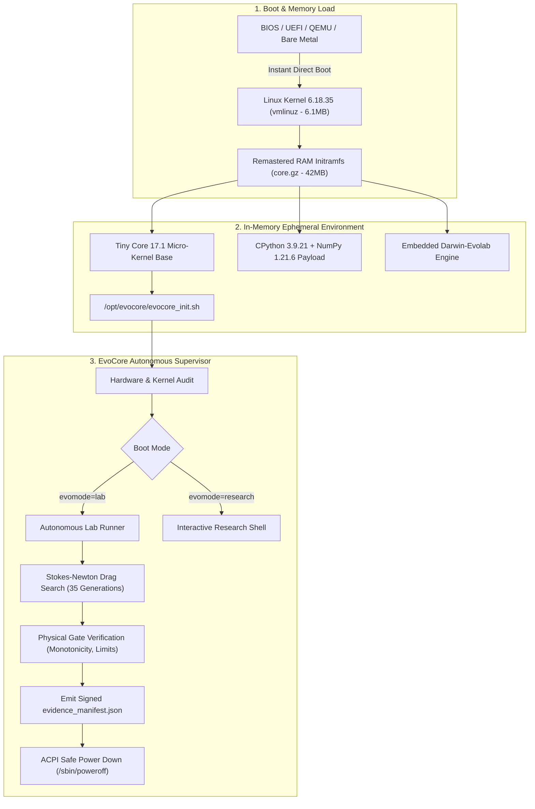

<div align="center">

```text
  ███████╗██╗   ██╗ ██████╗  ██████╗ ██████╗ ██████╗ ███████╗
  ██╔════╝██║   ██║██╔═══██╗██╔════╝██╔═══██╗██╔══██╗██╔════╝
  █████╗  ██║   ██║██║   ██║██║     ██║   ██║██████╔╝█████╗  
  ██╔══╝  ╚██╗ ██╔╝██║   ██║██║     ██║   ██║██╔══██╗██╔══╝  
  ███████╗ ╚████╔╝ ╚██████╔╝╚██████╗╚██████╔╝██║  ██║███████╗
  ╚══════╝  ╚═══╝   ╚═════╝  ╚═════╝ ╚═════╝ ╚═╝  ╚═╝╚══════╝
```

# EvoCore: Darwin-Evolab Autonomous Scientific Linux Appliance
**Minimal, Immutable, Cryptographically Attested Linux Operating Environment for Reproducible Scientific Discovery**

[](LICENSE)
[](https://github.com/bio-colab/EvoCore/releases)
[](https://github.com/bio-colab/darwin-evolab)
[](https://www.kernel.org/)
[](https://www.python.org/)

[English](#english) • [العربية](#arabic)

</div>

---

<a name="english"></a>
## 🌐 English Overview

**EvoCore** is an immutable, specialized, micro-kernel Linux operating appliance engineered specifically for autonomous evolutionary experiments, symbolic mathematics, and scientific law discovery.

### 🧬 Lineage & Scientific Origin
EvoCore was born from **[Darwin-Evolab](https://github.com/bio-colab/darwin-evolab)** — a multi-domain autonomous evolutionary discovery engine. While Darwin-Evolab provides the algorithmic brains (genetic algorithms, self-modeling, gate verification, and physics evaluators), **EvoCore provides its physical and computational body**: an immutable, sterile, operating environment where the evolutionary experiment is the primary mission of the operating system itself.

---

### 🚀 Key Architectural Pillars



1. **100% Bit-for-Bit Reproducibility**:
   In science, "it worked on my machine" is unacceptable. EvoCore encapsulates the entire operating system, kernel, C libraries, Python runtime, and evolutionary algorithms into a single **hermetic appliance** verified by SHA-256 hashes.
2. **Zero-Contamination RAM Execution**:
   The entire OS boots and runs purely in RAM (~69 MB disk footprint, ~400 MB RAM consumption). It leaves no traces on host storage and eliminates background OS noise or library version drift.
3. **Cryptographic Attestation & Evidence Manifests**:
   Every run produces a signed JSON manifest containing:
   - `environment_sha256`: Kernel + Architecture + Python Runtime
   - `specification_sha256`: Experiment Domain + Seed + Generations + Constraints
   - `solution_sha256`: Discovered Mathematical Formula + Fitness + Validation Error
4. **Bare-Metal & Virtualization Agnostic**:
   Bootable instantly via QEMU, VirtualBox, VMware, KVM, or burned directly onto a USB drive to turn any bare-metal PC into a dedicated evolutionary workstation.
5. **Declarative Appliance Factory (`evoforge.py`)**:
   EvoCore features a pure-Python remastering engine capable of generating customized ISOs matching declarative profiles:
   - `minimal`: Stokes-Newton fluid drag & symbolic algebra (~69 MB).
   - `symbolic`: Adds SymPy & Z3 SMT solver for formal theorem proving.
   - `eda`: Adds Yosys & Verilator for silicon hardware circuit synthesis.

---

### 💻 Quick Start & Host Launchers

#### Prerequisites
- **QEMU** (`qemu-system-x86_64`) installed.

#### Running on Windows
Within the `EvoCore/` directory:
- **Batch Launcher**: Double-click `run_evocore.bat`
- **PowerShell Launcher**: Run `.\run_evocore.ps1`

Select from the interactive menu:
```text
  [1] Interactive Laboratory Mode (Default)
      Opens graphical QEMU window with real-time ASCII telemetry & physics gates.
  [2] Headless Lab Runner + Evidence Export
      Runs silently in background, discovers physics formula, exports
      evidence_manifest.json to host Windows disk, and powers off automatically.
  [3] Research Shell Mode
      Boots directly into an interactive root shell with Python 3 & Darwin-Evolab.
  [4] Full ISO CD-ROM Boot
      Simulates physical hardware boot from EvoCore-minimal.iso with ISOLINUX menu.
```

#### Running on Linux / macOS
```bash
# Interactive Laboratory Mode
qemu-system-x86_64 \
  -kernel output/minimal/boot/vmlinuz \
  -initrd output/minimal/boot/core.gz \
  -append "console=tty0 quiet evomode=lab" \
  -m 512M

# Headless Autonomous Runner with Serial Capture
qemu-system-x86_64 \
  -kernel output/minimal/boot/vmlinuz \
  -initrd output/minimal/boot/core.gz \
  -append "console=ttyS0 quiet evomode=lab evopoweroff=1" \
  -serial file:output/last_run.log \
  -nographic \
  -m 512M

# Extract Evidence Manifest
python extract_manifest.py output/last_run.log output/evidence_manifest.json
```

---

### 📜 Evidence Manifest Contract (`evidence_manifest.json`)

```json
{
  "appliance": "EvoCore",
  "appliance_version": "0.2.0",
  "contract": "REPRODUCIBLE_SCIENTIFIC_EVIDENCE",
  "timestamp_utc": "2026-10-01 22:21:12",
  "execution_time_seconds": 22.26,
  "hardware_telemetry": {
    "system": "Linux",
    "node": "box",
    "kernel_release": "6.18.35-tinycore",
    "machine": "i686",
    "cpu_count": 1,
    "memory_total_mb": 494.93,
    "python_version": "3.9.21"
  },
  "signatures": {
    "environment_sha256": "743a83c5506d7954358f4a2b5466c539439ceb95358fd39b4c7e448a0132fcf2",
    "specification_sha256": "106d71668db6c9d654f53b213df9d6e840aad6c9596b189da88f344765a89eb6",
    "solution_sha256": "582646edf034a184f99ff5f64e812cadf113bc9b07083a5a53d6d8db24069f35"
  },
  "specification": {
    "domain": "stokes_newton_drag",
    "level": "LC",
    "generations": 35,
    "population_size": 30
  },
  "solution": {
    "formula_name": "BrownLawlerCandidate",
    "expression": "(((24 / Re) * (1 + (0.1532 * (Re ** 0.6756)))) + (0.4398 / ((Re ** 0.0200) + (8045.5980 / Re))))",
    "fitness_score": 99.5015,
    "e_gap": 0.00261,
    "passed_gates": true
  }
}
```

---

<a name="arabic"></a>
## 🌍 نبذة باللغة العربية (Arabic Overview)

**EvoCore** هو نظام تشغيل تجريبي علمي دقيق ومستقل، مبني فوق النواة المصغرة لـ Tiny Core Linux، ومصمم خصيصاً لتشغيل تجارب التطور الرياضي والفيزيائي واكتشاف القوانين العلمية في الذاكرة الحية (RAM) مع توثيق مشفر للأدلة.

### 🧬 الأصل والنسب العلمي
نشأ **EvoCore** كبيئة تشغيل سيادية مخصصة لمشروع **[Darwin-Evolab](https://github.com/bio-colab/darwin-evolab)**. فبينما يمثل Darwin-Evolab "العقل الخوارزمي" للاكتشاف والتطور الذاتي، يمثل EvoCore "الجسد الفيزيائي والتشغيلي" — نظام تشغيل مغلق ومكتفٍ ذاتياً تكون مهمته الأساسية والوحيدة هي احتضان التجربة العلمية وإثبات صحتها بدقة البتات (Bit-for-bit).

---

### 🌟 أهم المميزات والإمكانيات
1. **تكرار علمي قطعي 100% (Absolute Reproducibility)**:
   القضاء التام على مشكلة "اشتغل على جهازي". بيئة التشغيل بالكامل مع النواة والمكتبات معزولة في صورة مشفرة تنتج نفس النتائج الرياضية على أي جهاز في العالم.
2. **تنفيذ معقم في الذاكرة الحية (In-Memory Execution)**:
   يقلع النظام بأكمله في RAM بحجم أقل من **70 ميجابايت** وفي أقل من ثانية واحدة، دون ترك أي أثر أو ملفات مؤقتة على القرص الصلب.
3. **توثيق مشفر غير قابل للدحض (Cryptographic Attestation)**:
   كل اكتشاف فيزيائي يوقّع بـ 3 بصمات SHA-256 (بيئة العتاد والنواة + محددات التجربة + القانون المكتشف).
4. **تشغيل على عتاد مجرد (Bare-Metal)**:
   صورة الـ ISO الناتجة قابلة للحرق مباشرة على فلاشة USB لتشغيل أي جهاز كمبيوتر أو خادم كمحطة عمل تطورية مستقلة دون الحاجة لأي نظام تشغيل سابق.
5. **محرك بناء ذاتي (`evoforge.py`)**:
   أداة متكاملة بلغة بايثون تعيد بناء الـ ISO ونواة الذاكرة وفق ملفات تعريفية مرنة (`minimal`, `symbolic`, `eda`).

---

## 🛠️ Repository Structure

```text
EvoCore/
├── overlay/                 # Root filesystem overlays (/etc/os-release, /etc/inittab)
├── profiles/                # Declarative appliance specifications (minimal, symbolic, eda)
├── supervisor/              # Autonomous supervisor engine & hardware audits
│   ├── supervisor.py        # Python discovery supervisor & attestation generator
│   ├── evocore_init.sh      # Early kernel boot hooks & console multiplexer
│   └── banner.txt           # ASCII appliance branding banner
├── tests/                   # Pytest automated verification suite (6/6 passing)
├── evoforge.py              # Pure-Python declarative ISO remastering engine
├── extract_manifest.py      # Host helper extracting evidence manifests from serial logs
├── run_evocore.bat          # One-click Windows Command Prompt launcher
├── run_evocore.ps1          # One-click Windows PowerShell launcher
├── LICENSE                  # MIT Open Source License
└── README.md                # Project documentation & reference
```

---

## 🤝 Contributing & Community
We welcome contributions from researchers in evolutionary computation, physics simulation, formal methods, and operating systems engineering.
- Please review [CONTRIBUTING.md](CONTRIBUTING.md) for contribution guidelines.
- Report security issues according to [SECURITY.md](SECURITY.md).
- Open issues using our structured templates in [.github/ISSUE_TEMPLATE/](.github/ISSUE_TEMPLATE/).

---

## 📄 License
EvoCore is licensed under the [MIT License](LICENSE) © 2026 bio-colab.
Upstream Tiny Core Linux components remain under their respective open-source licenses (GPL / Artistic).
